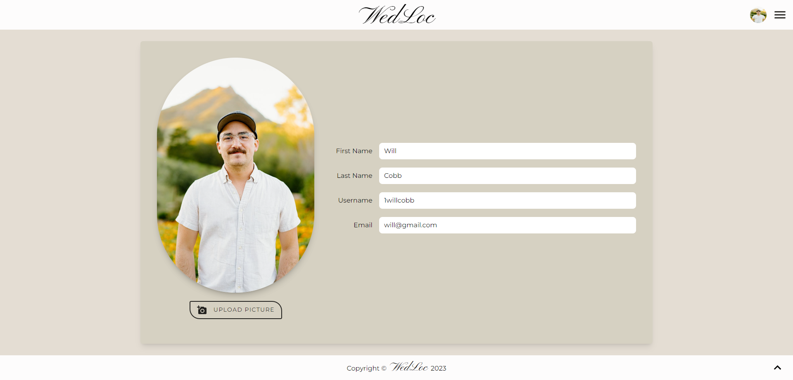
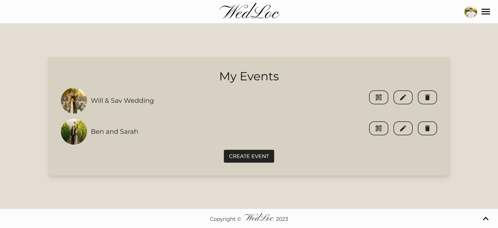
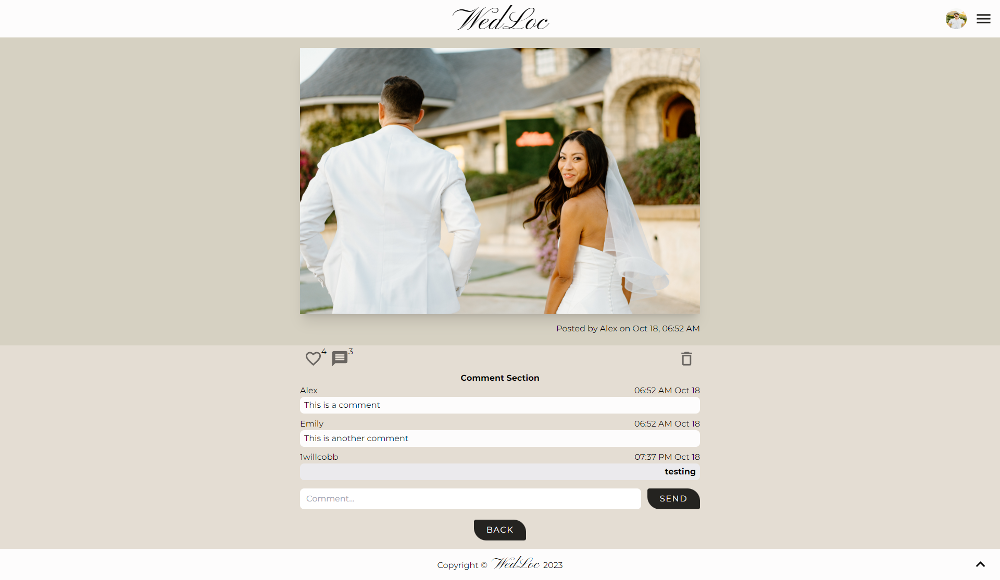
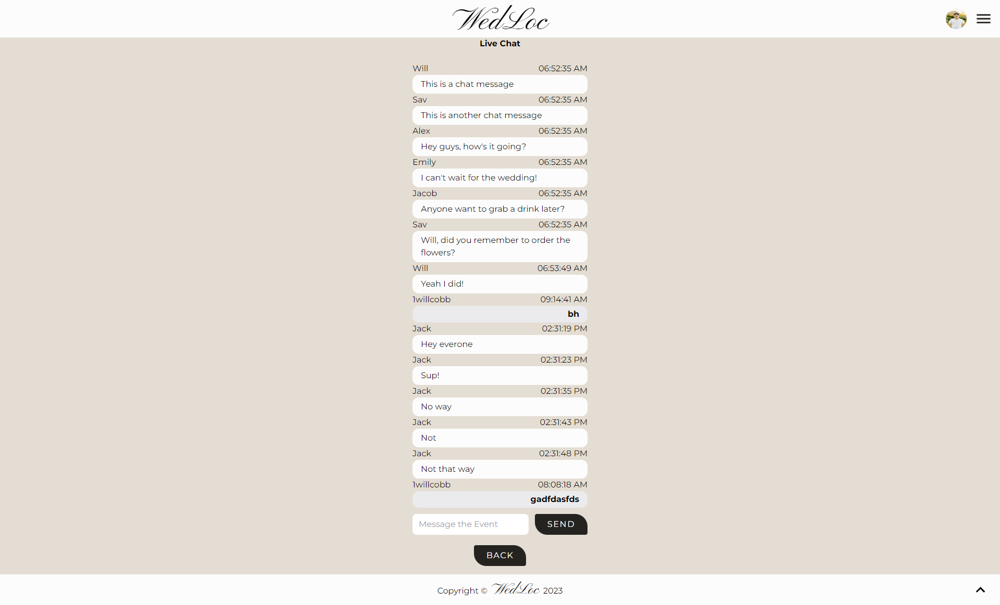

# WedLoc
A UC Berkley Full Stack Web Development Bootcamp Project 03

## Description

WedLoc is not just another wedding platform; it's a one-of-a-kind social hub designed exclusively for wedding photographers and videographers. Our mission is to provide a seamless space for professionals to organize and showcase wedding media, making it easy for couples and guests to relive their special moments. With added features like media comments and real-time chat, we've eliminated the need for attendees to sign up, making the entire experience hassle-free.

## Table of Contents

- [Description](#description)
- [Heroku Deployment](#heroku-deployment)
- [Features](#features)
- [Project Presentation](#project-presentation)
- [Visuals](#visuals)
- [Usage](#usage)
- [License](#license)
- [Credits](#credits)
- [Project Status](#project-status)

## Heroku Deployment

Here is the link to the deployment of our heroku app, [Wedloc](https://wedloc-84c89e3ae29d.herokuapp.com/)!

## Features

- Showcase wedding photos and videos from events
- Enable attendees to comment on media
- Real-time chat for interactive event experiences
- Share events with attendees for live chat and post-event interactions

## Project Presentation
[Google Slides](https://docs.google.com/presentation/d/1Yo2I2PPT58voscTfZmLJ5dglf2jHLGa8pu-2-s-DXNI/edit#slide=id.p)

## Visuals

## Usage

Use the link to [Wedloc](https://wedloc-84c89e3ae29d.herokuapp.com/) and signup with your first name, last name, username, email, and password.  The username, email, and passwords need to be unique for verification. Once you sign up you will be immediately taken to your own events page where you can create, view, edit, and delete your events as they fit your business needs.  This application is especially geared towards wedding planners, photographers, and videographers, but it can be used by anyone that wants to encapsulate their special moment in time.

Please note that this version of WedLoc is primarily for grading purposes by the UC Berkeley coding bootcamp staff.

## License
 This project is covered under the MIT public use license.

## Credits
- The Team
    - Arun Ayyasamy - <a href="https://github.com/arundvp" target="_blank">arundvp</a>
    - Avery Myers - <a href="https://github.com/AveryJMyers" target="_blank">AveryJMyers</a>
    - Edward Von Schondorf - <a href="https://github.com/Torvec" target="_blank">Torvec</a>
    - Jake Krauskopf - <a href="https://github.com/JaKrau" target="_blank">JaKrau</a>
    - Mark Thostesen - <a href="https://github.com/markthos" target="_blank">markthos</a>
    - Will Cobb - <a href="https://github.com/1willcobb" target="_blank">1willcobb</a>

## Project Status

WedLoc was successfully completed in October 2023.

Stay tuned for exciting developments and improvements as we continue to make WedLoc the go-to platform for wedding media sharing and interaction.

Thank you for considering WedLoc!